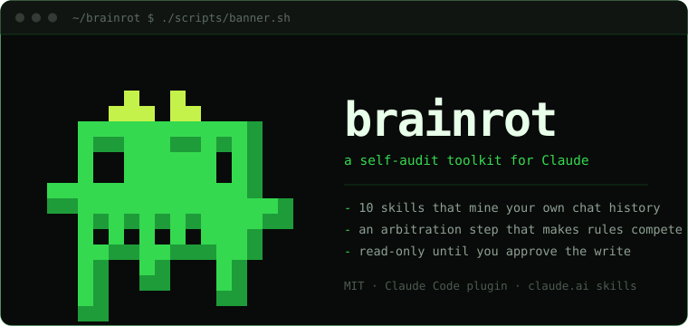

<div align="center">



<br>

[](https://github.com/coltonbearden/brainrot/actions/workflows/validate.yml)
[](LICENSE)
[](#install)
[](#whats-inside)
[](#privacy-and-safety)

**Your chat history already knows what Claude gets wrong for you.**<br>
`brainrot` turns that record into a small, maintained set of standing rules — instead of an ever-growing pile of vibes.

[Site](https://coltonbearden.github.io/brainrot) · [Install](#install) · [Skills](#whats-inside) · [Cycle](#the-cleanup-cycle) · [Privacy](#privacy-and-safety)

</div>

---

## The problem

Persistent memory has a hard line cap and it is usually mostly spent. So the rules you keep are whichever ones you happened to write down, in whatever mood you were in, and they never get audited. Meanwhile every correction you've ever typed — every "no, the other repo", every "you made that up", every "stop giving me fragments" — is sitting in your history as unexamined evidence.

`brainrot` reads that evidence, makes candidate rules **compete for scarce memory lines**, and writes once, with your approval.

```
        mine history  ->  audit rules  ->  arbitrate  ->  ONE gated write
        (5 skills)        (rule-drift)     (budget)       (memory-gc)
```

## Install

**Claude Code** — plugin, recommended:

```
/plugin marketplace add coltonbearden/brainrot
/plugin install brainrot@brainrot
```

Skills are namespaced (`/brainrot:memory-gc`, …) and also fire on natural phrases — *"run memory gc"*, *"what annoys me"*, *"run praise miner"*.

**claude.ai app** — per-skill upload. The mining skills were designed around the app's past-chats and memory tools, so this surface gets the richest behavior:

```bash
bash plugins/brainrot/scripts/package_claude_ai_zips.sh   # -> dist/<skill>.zip
```

Then **Settings → Capabilities → Skills → Upload skill**, one zip per skill.

> **First run:** start with `run usage retro` on a 30-day window. It tells you whether your history has enough correction volume for the mining skills to find signal — before you spend a session on a full cycle.

## What a run looks like

`rule-drift` scores your existing rules against what actually happened, and gates every retirement on your confirmation. From the bundled fixture:

```
Rule drift audit — 2026-08-01
Window: 2026-07-02 -> 2026-08-01 · Coverage: FULL (41 chats)

| rule | verdict   | draft                                                          |
|------|-----------|----------------------------------------------------------------|
| K1   | KEEP      | —                                                              |
| K2   | REINFORCE | "…state the assumed target inline before acting."              |
| K3   | RETIRE    | confirmed by user 2026-08-01                                   |
| K4   | KEEP      | —                                                              |
| K5   | KEEP      | —                                                              |
```

That retired line is the whole point: it's the headroom the mining skills' proposals then compete for. Try the full arbitration pass against the fixture without touching your own memory:

```
/brainrot:arbitrate plugins/brainrot/fixtures/example-cycle
```

## What's inside

One plugin, `brainrot` — ten skills and two commands.

| Skill | What it does |
|---|---|
| `memory-gc` | Audit + consolidate persistent memory; verify volatile claims against history; single gated write |
| `rule-drift` | Score adherence to your standing rules; verdict each KEEP / REINFORCE / REWRITE / RETIRE |
| `claim-audit` | Find facts Claude asserted that you corrected; root-cause; draft prevention rules |
| `ambiguity-preempt` | Find clarify-loops and wrong guesses; draft standing disambiguation defaults |
| `friction-audit` | Mine frustration/correction patterns; rank; one remediation per pattern |
| `praise-miner` | Find praised zero-correction outputs; extract the antecedents; draft do-more rules |
| `decision-ledger` | Harvest real decisions (human commitments only) into one dated, conflict-checked ledger |
| `usage-retro` | Sampled 7/30-day retrospective: correction rate, delegation ratio, trends |
| `skill-prospector` | Find recurring task shapes worth packaging as skills; scored backlog |
| `handoff-distill` | Distill a session into a canonical handoff block with provenance gates |

| Command | What it does |
|---|---|
| `/brainrot:runbook [cycle-dir]` | Where you are in a cleanup cycle, and the exact next step |
| `/brainrot:arbitrate <cycle-dir>` | Phase 3: arbitrate proposed rules into a budget-fitted selection (interactive veto gate) |

Five of these skills propose rules. The arbitration step exists so they compete on evidence instead of landing by default.

## The cleanup cycle

Ordering is not "cheap to expensive" — it's that the generators must not run before the auditors, or you blow the line budget and arbitrate under pressure. Pin one analysis window (default 30 days) and reuse it in every phase.

| Phase | Skills | Why here |
|---|---|---|
| **0 · Baseline** | `usage-retro` (30d) | Your before-picture; confirms the corpus has signal |
| **1 · Ground truth** | `decision-ledger` → `rule-drift` | Read-only. Retirements here free the budget Phase 2 will need |
| **2 · Mine** | `claim-audit` → `ambiguity-preempt` → `friction-audit` → `praise-miner` | Narrow → broad, so each pass reports only the residual |
| **3 · Arbitrate** | `/brainrot:arbitrate` | Cluster, score, fit to real headroom, veto gate |
| **4 · Write** | `memory-gc` | The only phase that mutates state. Once |
| **5 · Forward** | `skill-prospector` → `handoff-distill` | Seeds from *post*-GC memory, so it doesn't mine retired entries |

Don't attempt all ten in one thread — the mining skills are read-heavy and you'll run out of context mid-audit. Split at roughly Phase 1 / Phase 3 / Phase 5 and run `handoff-distill` at each boundary.

Full reasoning: [`docs/runbook.md`](plugins/brainrot/docs/runbook.md). Re-run `usage-retro` in 30 days — correction rate is the one number that should move if the new rules landed.

## Privacy and safety

This toolkit reads your conversation history. That deserves a straight answer:

- **Nothing leaves your session.** There is no telemetry, no network calls, no analytics, no external service. The skills are Markdown instructions; the scripts are local file operations.
- **Read-only by default.** Every skill is read-only until you approve a written before/after plan. `memory-gc` states the expected end-state count, waits for explicit confirmation, then re-reads to verify what actually landed.
- **Exports stay local.** `plugins/brainrot/scripts/cc_history_export.py` writes `conversations.json` to your working directory. [`.gitignore`](.gitignore) excludes `conversations*.json` and `*-export.json` so an export is never committed by accident.
- **Sensitive content is skipped, counted, never quoted.** Every mining skill carries a `SKIPPED-SENSITIVE` convention. Health, grief, and crisis content is not surfaced, not summarized, and not turned into a rule.
- **Provenance gates.** An assistant *suggestion* never becomes a "decision" or a standing rule without an explicit human commitment. Praise is evidence about what to repeat, not a record of a decision. Unverifiable claims go to you for a ruling instead of being silently rewritten.
- **Budget honesty.** Arbitration fits rules to real headroom and tells you when there is none, rather than smuggling rules past the cap.

## Surfaces

| Capability | claude.ai app | Claude Code | Anywhere with an export |
|---|---|---|---|
| History sweeps | native | — | via export pass |
| Export ("deep") mode | native (upload) | native (local file) | native |
| Memory staging | `memory_user_edits` (30-entry cap) | memory file, e.g. `~/.claude/CLAUDE.md` | memory file |
| `/brainrot:*` commands | — (use the paste-in prompt) | native | — |

No past-chats tools in your environment? Every skill also runs against a conversations export — same lexicon, thresholds, gates, and output format. Details and path mapping: [`docs/surfaces.md`](plugins/brainrot/docs/surfaces.md).

## FAQ

**Where do I start?** `run usage retro` on a 30-day window. It tells you whether your history has enough correction volume to be worth mining.

**Do I need the claude.ai app?** No. The app's past-chats tools give the richest sweeps, but every skill also runs in export mode against a `conversations.json`, including one produced from local Claude Code history.

**Will it overwrite my memory?** Only after you approve an explicit before/after plan, and only in `memory-gc`. Every other skill reports and stops.

**Can I run all ten in one session?** Not usefully — split the cycle at the Phase 1 / 3 / 5 boundaries and carry state across with `handoff-distill`.

**Is this an Anthropic product?** No. Independent, community-built, MIT.

**How do I know it worked?** Re-run `usage-retro` 30 days later. Correction rate is the one number that should move.

## Repository layout

```
.claude-plugin/marketplace.json      marketplace catalog
plugins/brainrot/                    the plugin
  .claude-plugin/plugin.json
  commands/                          runbook, arbitrate
  skills/<name>/SKILL.md             the ten skills
  docs/                              runbook, surfaces, arbitrate-prompt (v2.1)
  scripts/                           cc_history_export.py, validate.py,
                                     package_claude_ai_zips.sh
  fixtures/example-cycle/            worked arbitration input for testing
docs/build-prompts/                  provenance: the prompt each skill was built from
docs/index.html                      the project site (GitHub Pages)
scripts/banner.sh                    terminal banner
assets/                              mascot + banner
```

[`docs/build-prompts/`](docs/build-prompts) is the toolkit's provenance — one standalone build prompt per skill, usable as templates for building your own.

## Development

```bash
claude plugin validate .                       # official schema check
python3 plugins/brainrot/scripts/validate.py   # structural + frontmatter invariants
./scripts/banner.sh                            # say hello to the mascot
```

The structural validator enforces what the official schema doesn't: every `SKILL.md` carries exactly `name` + `description` frontmatter, `name` matches its directory and is kebab-case, descriptions stay under 200 characters, and bodies stay under 500 lines. Both run in CI on every push.

Contributions welcome — see [CONTRIBUTING.md](CONTRIBUTING.md). New skills should follow the build-prompt pattern in `docs/build-prompts/`.

## Credits

The mascot is an original pixel creature drawn for this project — see [`assets/mascot.txt`](assets/mascot.txt) for the ASCII version and palette. Vector: [`assets/mascot.svg`](assets/mascot.svg).

## License

MIT — see [LICENSE](LICENSE).

<div align="center">
<br>
<sub>An independent, community-built plugin. Not affiliated with, endorsed by, or sponsored by Anthropic.<br>
Claude and Claude Code are trademarks of Anthropic.</sub>
</div>
